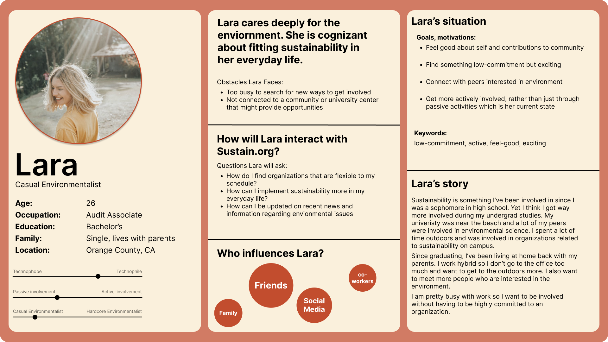
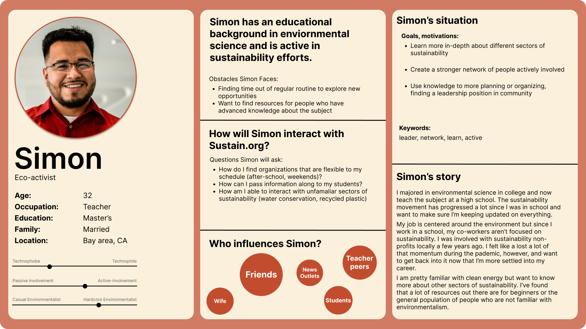

theme: jekyll-theme-minimal
# UX Redesign for Institute for Sutainable Communities
## Maham Khawar- UCLA DH110 Seminar: User Experience Design

## Introduction: a brief information about the project. 
This project is about doing a re-design of the Institute for Sustainability's website, to make the site more usable in accordance with the ten usablity heuristics. For this redesign, I focused on increasing user control and freedom, flexibility and efficiency, and lastly creating an aesthetic and consistent design throughout all pages. I first completed a heuristic evaluation and conducted usability tests of the currrent site. I then went on to do user research based on someone who fit the demographic of being interested in sustainability and is a young adult between 25 and 35 years old. Based on this user research, I created user persona and scenarios based on the different types of users who would most frequent the site. From there, I moved on to create a low fiedlity prototype based on what users wanted to get out of the site as well as my own experience from the heuristic evaluation and personal navigation of the website. Lastly, I created multiple revisions of a high-fidelity prototype for a mobile version of the website. 

## Design Statement
The goal of this project was to make the website for the Institute for Sustainable Communities more usable, following the ten usability heuristics. By making the site more usable, it will be able to cater more fully to the needs of both passive and active members of the sustainable community on a national level. The issues with the current site include it being outdated and inconsistent among different pages. Additionally, the site it hard to navigate and results in confusion by the user. Thus many helpful resources the site provides go unnoticed due to user frustration, resulting in them quitting the site. By resolving these issues, the user is able to find helpful information about sustainability which not only helps them but our planet as well. 
## Competitor Analysis 
I conducted a heuristic evaluation which can be found [here](https://mahamkhawar.github.io/DH110-22F-MahamKhawar/assignment01/). From the heuristic evaluation we found that the original site is not tailored to any specific age group, but a general adult population who has any sort of interest or passion in sustainability. The site did score well on certain heuristics including match between system and real world visibility of the system status. However, it recieved higher severity ratings when it came to a minimalist design and user control and freedom. Thus, I made sure to note these when creating my prototypes. 
I also conducted a usability test [here](https://mahamkhawar.github.io/DH110-22F-MahamKhawar/assignment02/). From this useability test, I found that many usablity issues were found which coincided with what was found in the heuristic evaluation. The user often got confused due to the inconsistencies on the site and there was limitations with freedoms. For example, the user faced limitations when trying to filter between different media types (e.g. only looking for podcasts rather than articles). 

## User Research

The user interview can be found [here](https://mahamkhawar.github.io/DH110-22F-MahamKhawar/assignment03/). I began by specifying the research goal and requirements, which I specified as the main acivity of the site to connect users with sustainability oriented projects in their local community. I then went on to target users aged as young adults from 25-35 who are either actively and passively engaged with sustainable efforts. After that, I picked the qualitative research method which was supported by a contextual inquiry guide. I recorded this interview while also keeping the transcription. 

## UX Storytelling 

From the user research, I went on to create user personas which can be found  [here](https://mahamkhawar.github.io/DH110-22F-MahamKhawar/assignment04/). I created two personas based on the types of users I identified from the user research, which includes an active user and a passive user. I created Lara, a casual environmentalist, and Simon who identifies as a more active user who wants to get more physically involved with sustainable efforts. 

## Wireframe and graphic design element variation

I then created wireframes, which can be found [here](https://mahamkhawar.github.io/DH110-22F-MahamKhawar/assignment05/). After digital storytelling and creating the personas and journey maps, I focused in on my tasks to be getting involved and finding reliable resources. I created wireframes by drawing out frames with simple graphical elements on pieces of paper.I had a participant go through and test the low-fidelity prototyping.  

## Low-fidelity prototype

After creating the wireframes on pen and paper, I digitizied it through a [low-fidelity prototype](https://www.figma.com/file/xvuF3d8NpoqArfcYPrvAR8/Untitled?node-id=0%3A1) which can be found in full [here](https://mahamkhawar.github.io/DH110-22F-MahamKhawar/assignment05/). By creating the prototype on figma, I was able to visualize the tasks I wanted the user to go through. After creating a low-fidelity prototype, I then moved on to create a high-fidelity prototype, which can be found [here](https://mahamkhawar.github.io/DH110-22F-MahamKhawar/assignment06/). I started off by selecting a chosen wireframe to base the high fidelity off of. I then created a grid to properly lay out all elements and then created different typographic, shape, and color variations. 

## High-fidelity prototype

After, creaitng a high-fidelity screen that includes typographic, color, and shape specifities I made this [prototype interactive](https://www.figma.com/proto/HYb1oEP49dYpL5DHfSJezO/Prototype-1?page-id=0%3A1&node-id=1%3A2&viewport=203%2C182%2C0.27&scaling=scale-down&starting-point-node-id=1%3A2), which can be found  in depth [here](https://mahamkhawar.github.io/DH110-22F-MahamKhawar/assignment07/). Based on the feedback, I knew to make the navigation more interaction, include more descriptive signifiers, and fix a few inconsistencies or bugs for my second interation. 

## Pitch Video

<figure class ="video_container">
   <iframe width ="560" height = "315" src="https://www.youtube.com/embed/bBCrcHsH2fQ" frameborder ="0" allow="accelerometer; encrypted-media; gyroscrope; picture-in-picture" allowfullscreen></iframe>
  </figure>
                                                                                                
## Conclusion 

From this quarter, I feel that I was able to learn a lot about the design process. Before going into this class I would say I preferred user research, and while that hasn't changed, I do feel that I both understand and appreciate the user interface design aspect of user expereience more. 

The parts of this project which definitely challenged me includes the prototyping asepcts of the process. I found high-fidelity prototyping to be somewhat diffcult, especially becuase I have internship experience when it comes to digital storytelling and interviewing. However, I liked how I had full control of taking what I learned from user interviews and placing it on the physical product. Each design choice I made was based on research I had conducted and it was fruitful to see that come into play.

All in all, this definitely was a challenging project and course sometimes but I learned a lot of skills and informations which I can put towards my career post-graduation, and I am very grateful to have this opportunity!

