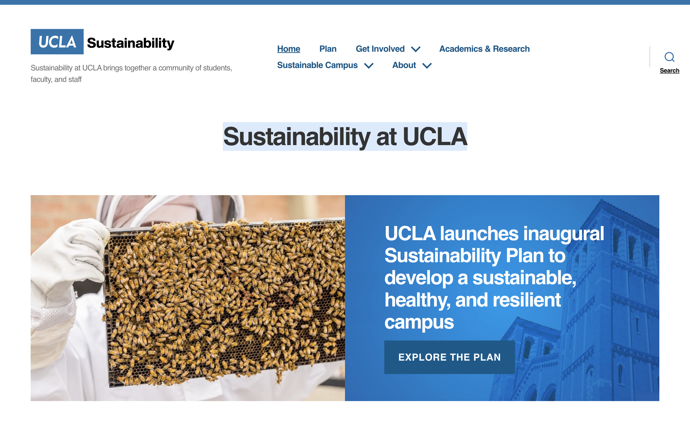

# Assignment 01

## Tentative Title: City-Slickers & Sustainability 
### Maham Khawar, DH110
#### About the project
According to the UN, 6 in 10 people will live in urban areas by 2030. Currently, the world's cities occupy only 3% of land, but are responsible for up to 80% of total world energy consumption and 75% of carbon emissions. With such high urban populations coupled with extremely wasteful practices, it is crucial that people are both informed and active in regards to making their comunity better for all those living within it. Thus, I chose to focus in on a UX project which will aim to get younger members of the generation involved in making the cities which they live in more sustainable as well as maintaining sustainable practices themselves. I chose to focus on younger groups as these are the age groups who tend to flock to the city, which is the most impactual area of unsustainable practices.

In this assignment, I will conduct a heuristic evaluation of two websites which share similar goals to this project in informing about sustainability. The first site, Institute for Sustainable Communities, aims to help communities on a global scale of their economic, enviornmental, ans social challenges. The site lists multiple areas of impact, one being cities and rapid urbanization. The second site is Sustainability at UCLA, which focuses in on sustainability at the university-level, while also incorporating academics and how to get involved as a student.  

#### Competitor A: Institute for Sustainable Communities

View full site here: [Institute for Sustainable Communities](https://sustain.org/)
#### Background Information
The Institute for Sustainable Communities has a global focus through focusing on three areas of impact: factories, community resilience, and cities. Their locations include the U.S., China, Bangladesh, and India. They approach creating sustainable communties by focusing on projects such as clean energy, urban systems, and water. In addition to information about their physical impact and donation information, they have a blog and podcast section which aim to tell stories of their work and inform about practices. 
#### Heuristic Evaluation
*Overall Evaluation*: This website is not tailored specifically as a resource for sustainable living practices in urban areas, however it does list urban and city areas as an area of impact. The site is also not specifically made for younger generations, but rather any member of the general population who has an interest in sustainability. The website 

| Heuristic & Description | Evaluation | Reccomendation for "Bad" Elements | Severity Rating |
| ------------- | ------------- || ------------- || ------------- |
| 1. Visibility of system status | Good: The site highlights the button you are hovering over, drawing your attention.
Good: The site has a large prominent search button in the upper right corner for users throughout the site, so it's easy to navigate.
Bad: The site does not highlight the menu uption so it isn't always obvious where you are in the site. | Highlight both the main menu option and sub-menu options so users can easily know exactly where on the site they are. | 1 | 

| 2. Match between system and the real world | Content Cell  |
| 3. User control and freedom |
| 4. Consistency and standards |
| 5. Error prevention |
| 6. Recognition rather than recall |
| 7. Flexibility and efficiency of use |
| 8. Aesthetic and minimalist design |
| 9. Help users recognize, diagnose, and recover from errors |
| 10. Help and documentation | 

#### Competitor B: Sustainability at UCLA

View full site here: [Sustainability at UCLA](https://www.sustain.ucla.edu/)
#### Background Information
Sustainability at UCLA focuses in on everything sustainability-related on campus, including transportation, food, green building, energy, waste, and more. In addition to being an informative site where students can learn about on-going campus initiatives, the site also lists resources to get involved in sustainability as a student such as through organizations, subscribing to the e-letter, and campus research. 
#### Heuristic Evaluation
*Overall Evaluation*: 
