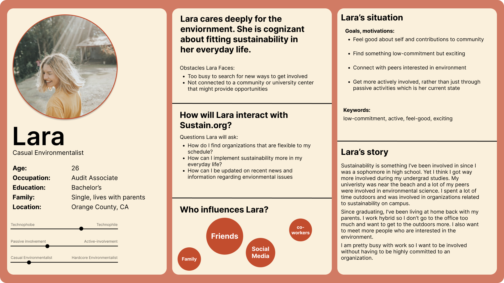
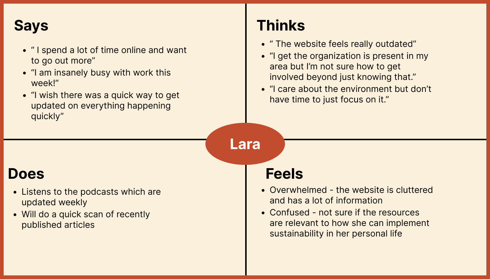
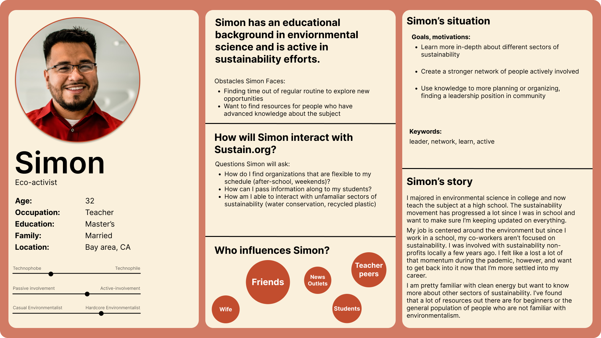
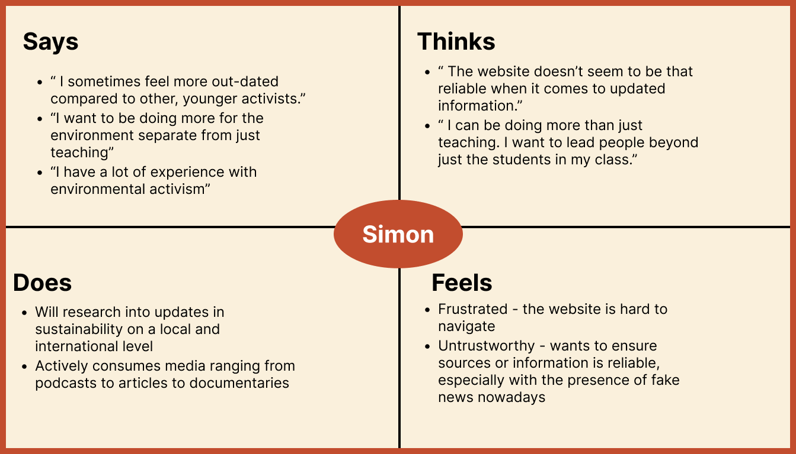
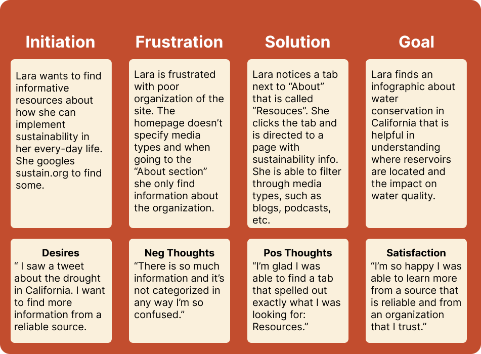
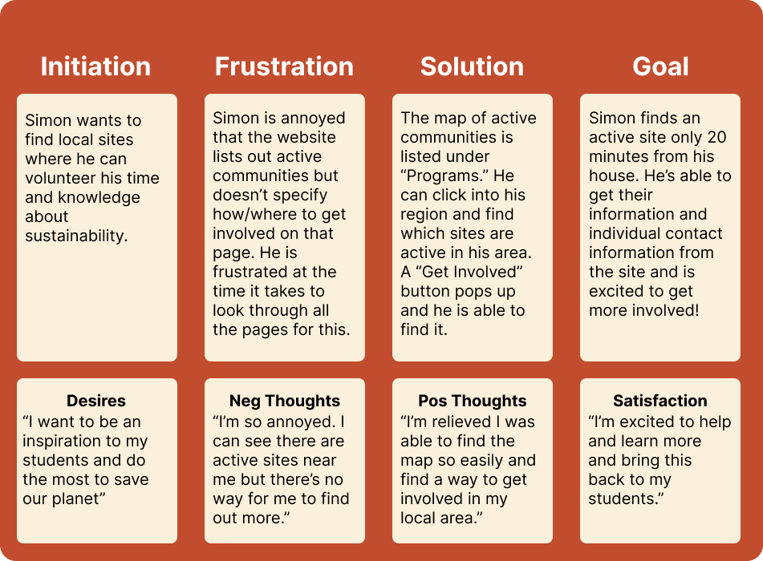

# DH110-22F-MahamKhawar
## Assignment 4

### Digital Storytelling: 
Digital storytelling is essential to User Experience. It allows the researcher to delve into the mind and emotions of the user, which is key when understanding how they interact with products. By stoytelling, we are putting a face to a name, even if it is hypothetical. By attempting to put ourselves in the shoes of the user, we are then able to go through the entire journey of being introduced to a product and experiencing it's positives and it's pitfalls. We are then able to able to better and more empathetic solutions to problems.

### Tasks: 

#### Task 1: Finding resources (blogs, infographics, podcasts)
The first task is designed for users of the website who engage with sustainability in a more passive way. They are usually not experts on environmentalism, yet still want to be involved beyond their current capacity. From the research thus far with pilot usability testing and user research, I've found that one important factor is for users to get their information in a simple and reliable way. For many users who are younger, it is common to get information from social media where sources aren't listed and it is very cluttered in terms of format. Thus, providing users with resources for information in how to implement sustainability from reliable experts at the Institute for Sustainability would be impactful for users of the site as well as the cause.

#### Task 2: Getting actively involved (local community sites, volunteering)
The second task is focused on users getting actively involved with specific sites in their local community. Users should be able to find direct contact information for active sites in their local region. This is for users who tend to be more knowledgable or active when it comes to their humanitarian desires. They might have a background in environmentalism or are already passively involved with getting reliable information through other routes. Thus, the task of getting involved with the local community should be efficient, as to not deter users nor lose their motivation in volunteering their time.

### Personas

#### Persona 1: Lara

#### Empathy Map 1: Lara

#### Persona 2:

#### Empathy Map 2: Simon 

### User Scenarios and Journey Map

#### Lara's Scenario
Why:

Lara is a young professional who leads a busy very life. She semi-recently graduated from university, where she was involved in a lot of sustainable activities on-campus. Since moving back home, she hasn't found much time to be as involved actively as she used to be but still wants to stay informed on sustainable efforts from a reliable source. 

How:

- Lara is scrolling through twitter when she sees that the California drought is a trending topic. She wants to learn more but is hesitant on looking more just on other websites that aren't backed by a reliable organization. In searching for resources related to sustainability, Lara logs on to the website for the Institute for Sustainable Communities. She scrolls through the homepage and sees a bunch of blocks consisting of a mix of podcasts, blogs, and infographics about information relating to sustainable communities. She begins to get frustrated at the layout of the homepage, as she is confused about the mixed media types. 
- Then, she spots an additional tab on the navigation bar that lists "Resources." Perfect, that is exactly what she was looking for. When she clicks on resources she is directed to a page which lists out resources about sustainability. She is able to filter out by media types as well as by specific topic. She filters out by the topic of water conservation and is able to find an inforgrpahic that educates her more on the subject. 
-  Lara is grateful that she was able to learn so quickly and is relieved at the fact that she got this information about the drought from a reliable source. She will make sure to implement some of the suggestions laid out in her daily life. 

#### Lara's Journey Map:

#### Simon's Scenario: 

Why: 

Simon is a high school science teacher. One of the courses that he teaches is environmental science, which he majored in and his very passionate about. He has a very busy life and is focused on starting a family as he is in his early thirties. However, he wants to be more active in the local community and use his in-depth knowledge to give back in a way other than through teaching.

How: 

- To look for active community sites, Simon logs on to his desktop computer during his lunchbreak and searches for www.sustain.org. He is familiar with the non-profit and begins his search for places he can get involved in the bay area, where he currently resides. Simon hovers over "Programs" which provides a drop-down menu to the different regions the non-profit is active in. Simon clicks "United States". Simon scrolls down to see that there are 700 communities where the Institute of Sustainable Communities is currently active again. This gets Simon excited that there might be some active in his area. This excitement soon turns to frustration as Simon can't seem to find specific information about the sites local to his area.
- Luckily for Simon, as he hovers his cursor over the map he is able to click into his specific region, being the bay area in California. The gives  control and freedom to the user as he is able to look over what other regions are up to when it comes to active sites. Simon is able to click the "Get Involved" button under a community site he is interested in getting involved in. There, he is redirected to a page which lists out more specific information on what is being done at the community site and contacts. 
- Simon feels satisfied that the process was quick and he was able to find what he was looking for during his lunch break at school.

#### Simon's Journey Map: 

