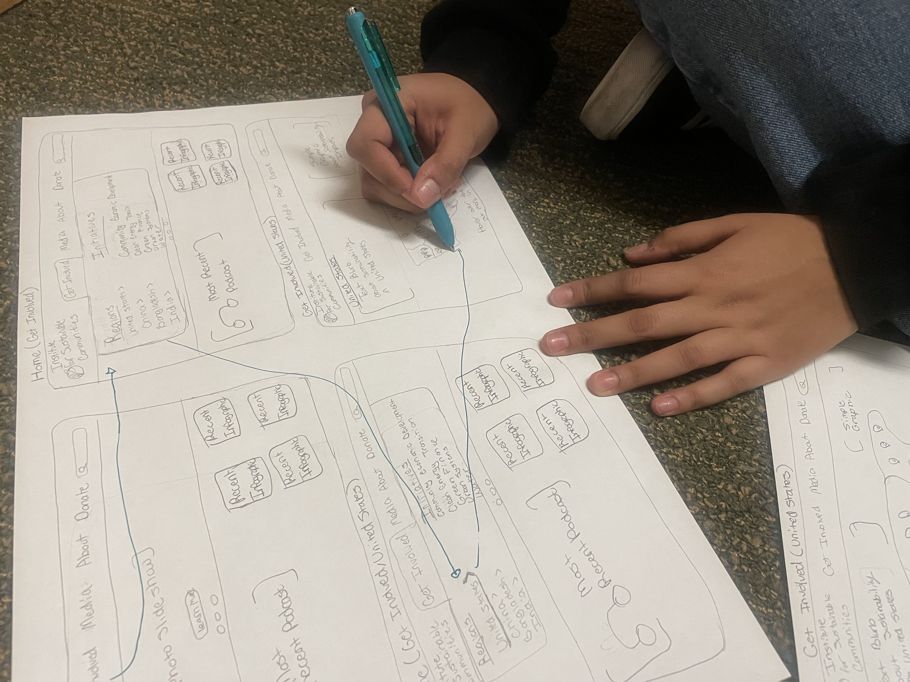
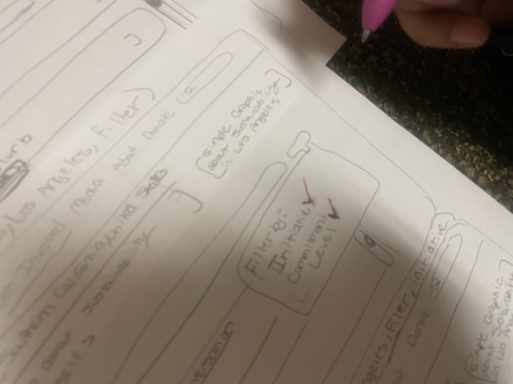
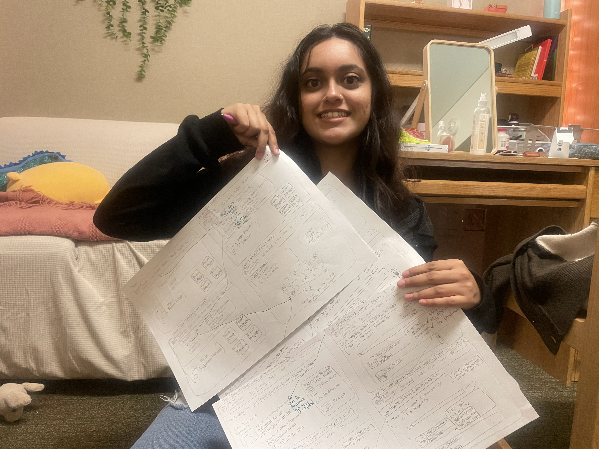
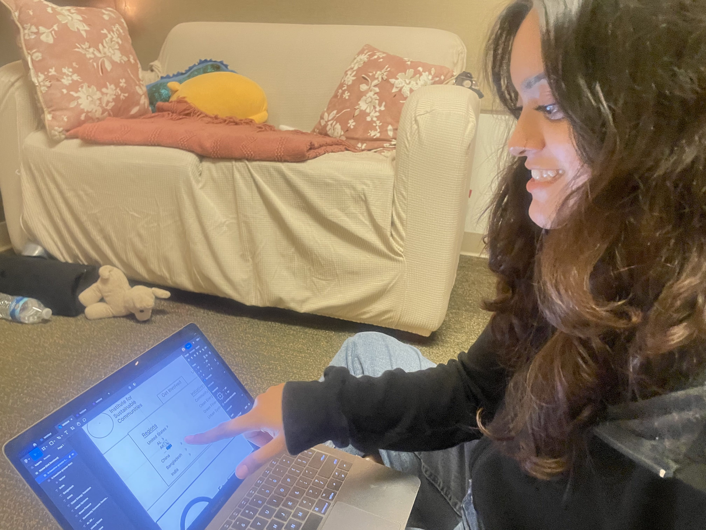

# DH110-22F-MahamKhawar

## Assignment-05-Low Fidelity Prototype

### Purpose: 
Low-fidelity prototyping is both a time-efficent and cost-efficient way to test the signifiers of what a product affords before the process of fully investing design-time into mid or high fidelity prototypes. By conducting low-fidelity prototyping, the designer is able to uncover interactions and inevitable issues early on which saves time and resources. The earlier one makes changes in a product life-cycle, the more usable we are able to make the product in later stages. 

### User Research: 
Based on the user research, I focus on these research questions:
- Finding out how to get involved 
- Finding reliable resources

### Personas: 
I created two personas that would solve each research question.
- Millenial science teacher who wants to get more actively involved in the community's sustainability efforts.
- A professional Gen-Z'er who wants to be involved in environmentalism, but in a more passive way which works with her hectic schedule.

### Tasks:
1. Contact Initiative in local area
2. Filter by different initatives

I chose these as my tasks becuase I found users of the site to struggle most with trying to get actively involved. When it came to finding media for passive engagement, many resorted to the searchbar right away, or would find what they were looking based on media type. Thus, I wanted to focus on tasks related to active engagement for this leg of the project. 

### Wireframes:

### Wireflow:

### Low-Fidelity Prototype Testing

Blue: Task 1

Pink: Task 2

The user was able to complete both tasks successfully, but did have trouble with the filter task as they noted it wasn's super clear on how to work the filter (dropdown, checkboxes, etc.)
 
### Low-Fidelity Prototype Testing Photos

### Low-Fidelity Prototype on Figma

I decided to refine the wireframes to be cleaner with revisions I collected from my prototype testing. Below is a photo of my participant observing one of the updated changed to the wireframe. 

Note: I am working on this file as I explore more about my project. Thus, some edits are going to be after the  deadline for this assignment. You can check version history on the file to explore what parts I completed before the deadline.
 
https://www.figma.com/file/xvuF3d8NpoqArfcYPrvAR8/Untitled?node-id=0%3A1

### Reflection

I really enjoyed creating the wireframes. When initially tasked with this assignment, I thought about making the wireframes on a digitial tool initially. However, I think be able to sketch out the wireframes on paper was really helpful in having me visualize any changes I would want to implement based on the personas and user research. I think all the eraser marks speak for themselves when saying that I was able to implement a change in the moment after physically visualizing it and realizing that wouldn't be best for the user. 

For the next time I create wireframes, there are things I need to improve on. First would be having more opportunity for exiting out of interactions, such as a more apparent back button. Additionally, there would need to be more efficieny feedback so the user knows they completed a task successfully. In terms of the actual process, I could've wireframed more backwards interactions and made the tasks not so closerly inter-related. My reasonings for this was because 
