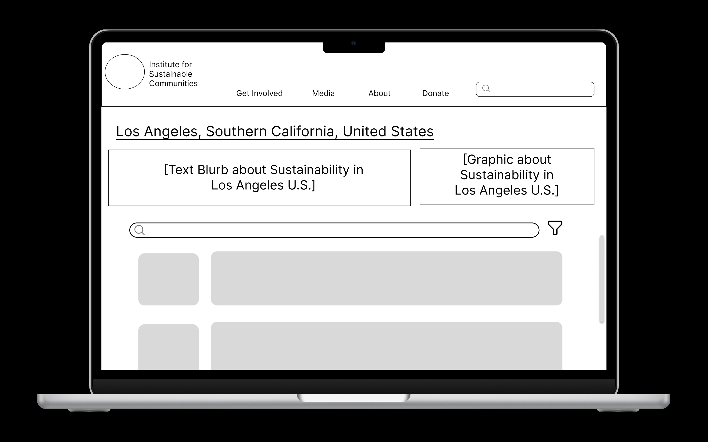
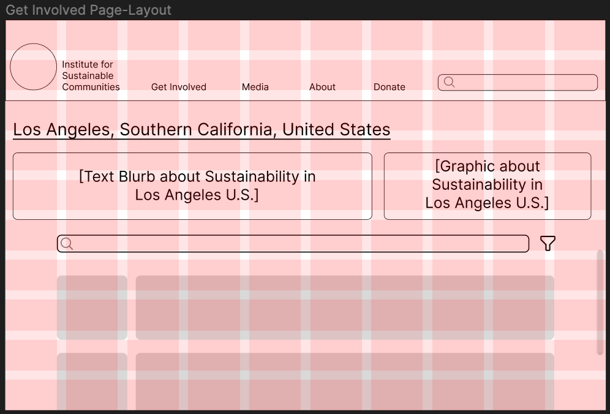
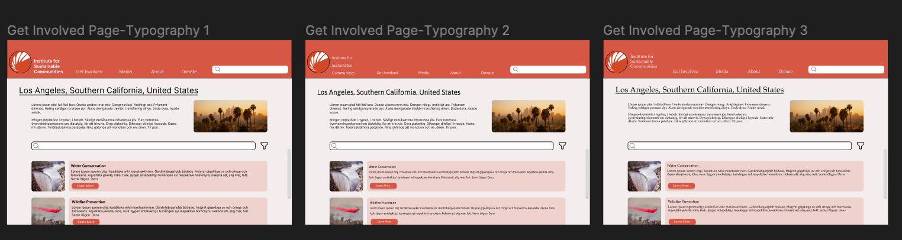
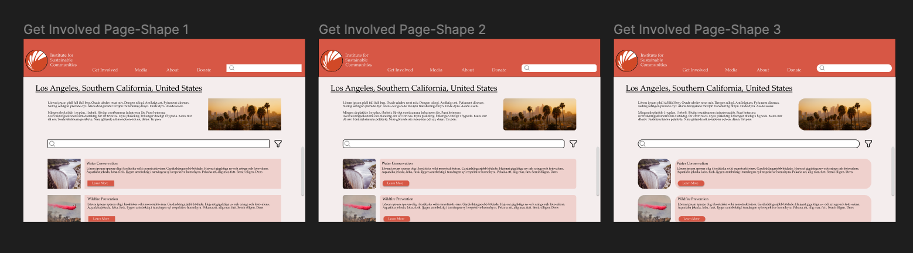
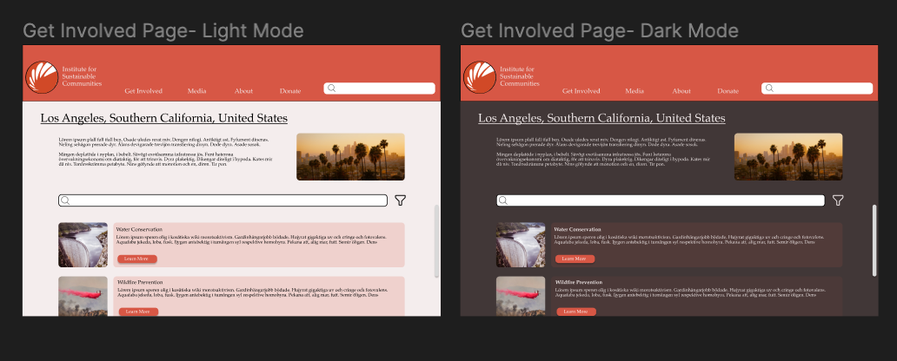

# DH110-22F-MahamKhawar
## Assignment 6 - Interface Design
### Project Brief and Key Tasks
The purpose of this re-design is to make the Institute for Sustainable Communities' website more usabable. This is by making it easier to navigate, intuitive, and overall cleaner. The key tasks which have been developed from the heuristic evaluation, usability testing, user interviews, personas, and journey mapping are as listed:

1. Ablility to find contact in local area for active involvement
2. Find relevant resources in preferred media format for passive involvement

### Purpose
The purpose of creating this interactive prototype is to digitize the lo-fidelity wireframes and create a styleguide for designs moving from this point forward. By being able to visualize the frames, we can pinpoint our solutions how users will intereact with them. 
### Process 
This interactive prototype was made using Figma, a collaborative tool for creating interface design. After creating hand-drawn low-fidelity wireframes, I transferred my deisgns to Figma, utilizing frames for a 14-inch Macbook Air. I used a grid to layout the structure for this redesign to ensure components were proportional and evenly distributed. I then went on to determine aspects such as typography, color scheme, and shape variation. From there I conducted an impression test and an accessibility check to gather initial feedback and ensure inclusivity in my re-design.

### Links
Digitized Wireflow: 
Interface design page that show test screens and design system information: 
### Chosen Wireframe

### Layout Design

### Typographic Variation

### Shape Variation

### Color Variation 

### Impression Test
[Video Link](https://drive.google.com/file/d/1RNlBj4dC-0CJA55CUaZXv3JS0FlthOjt/view?usp=sharing)
### Final Design Style Guide

### Accessibility Check 
