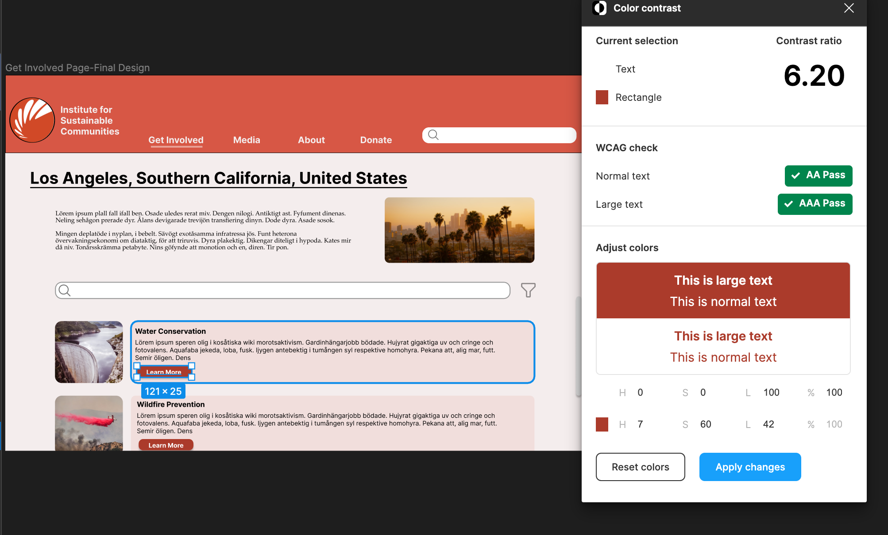

# DH110-22F-MahamKhawar
## Assignment 6 - Interface Design
### Project Brief and Key Tasks
The purpose of this re-design is to make the Institute for Sustainable Communities' website more usabable. This is by making it easier to navigate, intuitive, and overall cleaner. The key tasks which have been developed from the heuristic evaluation, usability testing, user interviews, personas, and journey mapping are as listed:

1. Ablility to find contact in local area for active involvement
2. Find relevant resources in preferred media format for passive involvement

### Purpose
The purpose of creating this interactive prototype is to digitize the lo-fidelity wireframes and create a styleguide for designs moving from this point forward. By being able to visualize the frames, we can pinpoint our solutions how users will intereact with them. 
### Process 
This interactive prototype was made using Figma, a collaborative tool for creating interface design. After creating hand-drawn low-fidelity wireframes, I transferred my deisgns to Figma, utilizing frames for a 14-inch Macbook Air. I used a grid to layout the structure for this redesign to ensure components were proportional and evenly distributed. I then went on to determine aspects such as typography, color scheme, and shape variation. From there I conducted an impression test and an accessibility check to gather initial feedback and ensure inclusivity in my re-design.

### Links
Digitized Wireflow: 
Interface design page that show test screens and design system information: 
### Chosen Wireframe

### Layout Design

### Typographic Variation

### Shape Variation

### Color Variation 

### Impression Test
Here is the [Video Link](https://drive.google.com/file/d/1RNlBj4dC-0CJA55CUaZXv3JS0FlthOjt/view?usp=sharing) for my impression test. I did a virtual meeting via Zoom for this test. The participant chose to keep their camera off, so it was just an audio-recording on their part. I first asked her general impressions of the site as well what she thinks the purpose of the site and even the page is. I then went on to show stylistic variations and had her identify preferences and thoughts about the variations. 

### Findings:
#### Overall Impression:
The participant was able to identify the purpose of the site immediately, and the task which was associated with the page.
#### Typography:
The participant preferred the first font type, which is Inter. The user also believed the font types to be different sizes, even though they were not.
#### Shape:
The participant preferred more curved shaped which I thought was interesting because it might take away from the professionalism of the site. 
#### Color:
The participant preferred light mode and stated that the dark mode could be improved with the orange overlay to make the contrast less harsh.
### Final Design 
From the impression test, I made some edits based on some of what the participant suggested. I took the suggestions of keeping the Inter font and I added a curviture of 15 for shapes to keep a balance between professionalism and friendliness. I also bolded header to make it pop out and be more apparent to the user. 

### Accessibility Check 

#### Text vs Background

#### Button vs Background

#### Button Label vs Button

### Design System: 

- Typeface:
- Color Scheme:
- Layout Grid: 
