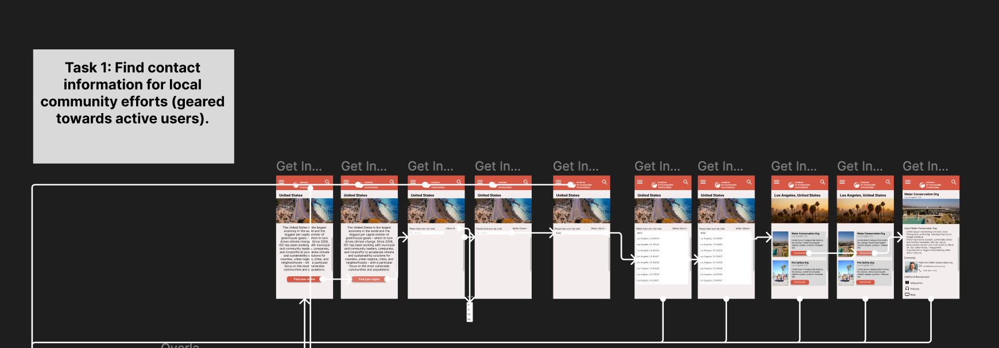
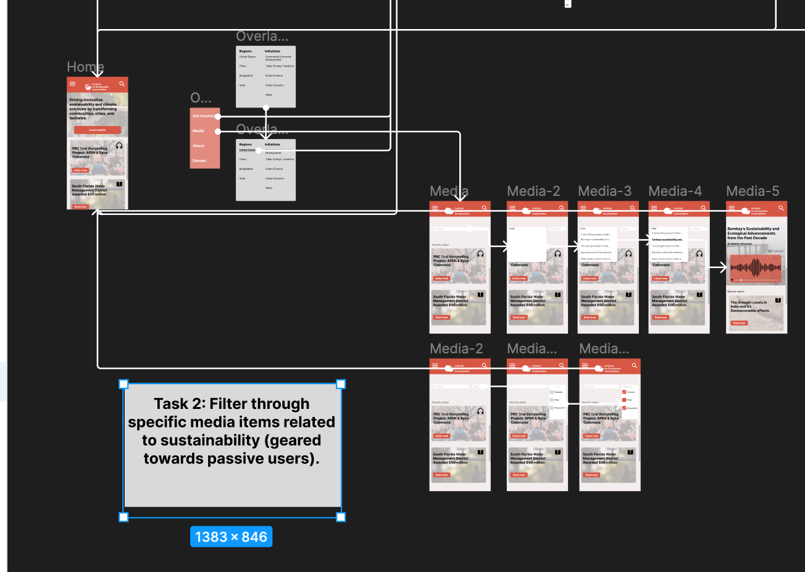

# DH110-22F-MahamKhawar
## Assignment 7: High Fidelity Prototype
### Overview
#### Summary
This prototype is a redesign of the Institute for Sustainabile Communities' mobile site, specifically it's resources and community involvement pages. This prototype attemps to make the site more usable for people who want to be both passively and actively involved with sustainable practices. 

#### Process
I based this high-fidelity prototype on previous low-fidelity sketches of the organization's desktop site. For this prorotype, I used Figma. I then continued on to coduct cognitive walkthroughs with peer and usability tests. From there, I created a revised high-fidelity protoype based on my findings. 

#### Purpose
The purpose of this interactive prototype is to test the interface of the mobile redesign in relation to the ten usability heuristics. For this iteration, I based my design loosely on my lo-fi screens but because I did a mobile re-design I did accomodate to changes on a smaller screen size.
#### Tasks
1. Filter through specific media items related to sustainability (geared towards passive users).
2. Find contact information for local community efforts (geared towards qctive users).
### Wireflow and final interface design
[Link to Wireflow](https://www.figma.com/file/vahxqm3gktrfkwjEUeQbvl/Wireflow?node-id=31%3A59&t=MI6AcaaIZ9HjXgUr-1)
#### Task 1 Flow

#### Task 2 Flow

#### Prototype (1st Iteration)
[Prototype Link](https://www.figma.com/proto/HYb1oEP49dYpL5DHfSJezO/Prototype-1?page-id=0%3A1&node-id=1%3A2&viewport=203%2C182%2C0.27&scaling=scale-down&starting-point-node-id=1%3A2)

### Cognitive Walkthrough - In-Class
[Cognitive Walkthrough Data](https://docs.google.com/spreadsheets/d/1OLTQzd9SlKe1sWnlE6MGolWR03hd6t1t23vkX-vsPRQ/edit?usp=sharing)

Overall, I did find the cognitive walkthrough to be a really informative process. The two participants were able to understand the flow of my two tasks while also providing constructive criticism and suggestions.

Based on the feedback provided, I would make the following edits in my redesign: 
- Make navigation bar more interactive, highlights what page user is on
  - Based on this feedback: " The navigation menu doesn't have indicators which page I'm at. If that could be highlighted, it would help the user know where they are."
- Make buttons have more signifiers that they're buttons (drop shadows, "Click here" text)
  - Based on this feedback: "I think some points should be more obvious to click"
- Add mobile navigation bar on bottom (for iPhone safari users)
  - Based on this feedback:  "I'm assuming that this website will have the navigation bar."
  
#### Prototype  (2nd Iteration)
 https://www.figma.com/proto/hLSJqi2WiMZvNWCffeVrcB/Prototype-2?page-id=0%3A1&node-id=1%3A2&viewport=-458%2C801%2C0.4&scaling=scale-down&starting-point-node-id=1%3A2
 
#### Usability Test
[Click here](https://youtu.be/Q4xNoTtYf38)

### Reflection

Overall, I found this interactive prototype to be very interesting. I enjoyed seeing everything come together to create a somewhat final product. I enjoyed the cognitive walkthrough, as it really highlights how central users suggestions are in the entire design process, and how they are consulted with nearly every step. 
